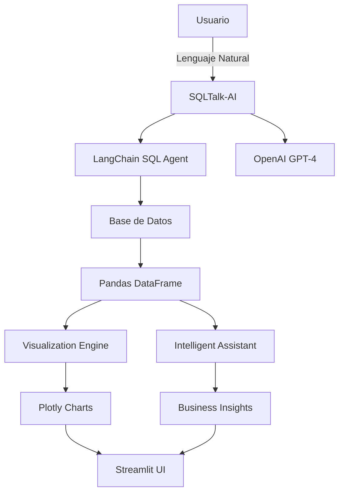

# 🤖 SQLTalk-AI: Asistente Inteligente para Consultas SQL

<div align="center">

[](https://www.python.org/downloads/)
[](https://streamlit.io/)
[](https://openai.com/)
[](https://opensource.org/licenses/MIT)
[](https://github.com/Edwin1719/SQL_Talk/stargazers)

**🔥 Transforma consultas en lenguaje natural en SQL con análisis empresarial inteligente y visualizaciones automáticas**

[🚀 Demo en Vivo](#-demo-rápido) • [📖 Documentación](#-guía-de-uso) • [🛠️ Instalación](#-instalación-rápida) • [🤝 Contribuir](#-contribución)

</div>

---

## ✨ ¿Qué es SQLTalk-AI?

SQLTalk-AI es una **herramienta revolucionaria** que permite a usuarios sin conocimientos técnicos realizar consultas complejas a bases de datos usando **lenguaje natural**. Powered by OpenAI GPT-4, no solo ejecuta consultas SQL sino que proporciona **análisis empresarial inteligente** y **insights accionables**.

### 🎯 **Problema que Resuelve:**
- ❌ Gerentes esperando días por reportes de TI
- ❌ Analistas perdiendo tiempo escribiendo SQL complejo  
- ❌ Decisiones empresariales retrasadas por barreras técnicas
- ❌ Datos valiosos encerrados en bases de datos inaccesibles

### ✅ **Solución que Ofrece:**
- 🚀 **Consultas instantáneas** en lenguaje natural
- 🧠 **Análisis IA automático** con insights empresariales
- 📊 **Visualizaciones inteligentes** generadas automáticamente
- 🔗 **Soporte multi-base de datos** (SQL Server, PostgreSQL, MySQL, SQLite)
- 💡 **Sugerencias de seguimiento** para análisis más profundos

---

## 🔥 Características Principales

<table>
<tr>
<td width="50%">

### 🧠 **Inteligencia Artificial Avanzada**
- **Natural Language Processing** para convertir preguntas a SQL
- **GPT-4 Analysis Engine** para insights empresariales profundos
- **Detección automática** de tendencias, anomalías y patrones
- **Context-Aware Assistant** que recuerda conversaciones previas

### 🗄️ **Soporte Multi-Base de Datos**
- **SQL Server** - Autenticación Windows integrada
- **PostgreSQL** - Soporte SSL completo
- **MySQL** - Compatible con todas las versiones
- **SQLite** - Para prototipado y desarrollo

</td>
<td width="50%">

### 📊 **Visualizaciones Inteligentes**
- **Auto-Chart Generation** basado en tipo de datos
- **Interactive Plotly Charts** con zoom y filtros
- **Custom Visualization Builder** para usuarios avanzados
- **Statistical Summaries** automáticos

### 🔍 **Análisis Empresarial**
- **Business Context Detection** (ventas, productos, clientes)
- **KPI Metrics Calculation** automático
- **Follow-up Query Suggestions** inteligentes
- **Session Memory** para análisis continuado

</td>
</tr>
</table>

---

## 🚀 Demo Rápido

### 💬 **Ejemplos de Consultas en Lenguaje Natural:**

```text
🗣️ "¿Cuáles fueron las ventas totales por producto el mes pasado?"
📊 Resultado: Tabla + Gráfico de barras + Análisis de tendencias

🗣️ "Muéstrame los 10 clientes que más han gastado este año"
📈 Resultado: Ranking + Análisis de segmentación + Sugerencias de retención

🗣️ "¿Qué productos tienen stock por debajo del mínimo?"
⚠️ Resultado: Lista de alertas + Impacto en ventas + Recomendaciones de reorden
```

### 🎯 **Análisis IA Automático:**
- **"Insight Clave: Las ventas del Producto A aumentaron 25% vs mes anterior"**
- **"Anomalía Detectada: Cliente XYZ redujo compras 80% en últimos 30 días"**
- **"Recomendación: Revisar stock de productos categoría Premium"**

---

## 🛠️ Instalación Rápida

### ⚡ **Opción 1: Instalación Express (5 minutos)**

```bash
# 1. Clonar repositorio
git clone https://github.com/Edwin1719/SQL_Talk.git
cd SQL_Talk

# 2. Configurar entorno virtual
python -m venv sqltalk
source sqltalk/bin/activate  # Windows: sqltalk\Scripts\activate

# 3. Instalar dependencias
pip install -r requirements.txt

# 4. Configurar API Key
cp .env.example .env
# Editar .env con tu OPENAI_API_KEY

# 5. ¡Ejecutar!
streamlit run app_sql.py
```

### 🔧 **Opción 2: Instalación como Package**

```bash
pip install git+https://github.com/Edwin1719/SQL_Talk.git
sqltalk  # Comando directo desde terminal
```

### 📋 **Prerrequisitos:**
- Python 3.8+
- [OpenAI API Key](https://platform.openai.com/api-keys) (¡gratis para empezar!)
- Driver de tu base de datos (auto-instalado con requirements.txt)

---

## 📖 Guía de Uso

### 🔌 **1. Conexión a Base de Datos**

<details>
<summary><b>🟦 SQL Server (Windows - Recomendado)</b></summary>

```text
✅ Autenticación Windows (Más fácil):
   - Servidor: [Dejar vacío para detección automática]
   - Database: [Dejar vacío para usar 'master']
   
✅ Autenticación SQL:
   - Servidor: localhost\SQLEXPRESS
   - Database: tu_base_datos
```
</details>

<details>
<summary><b>🟩 PostgreSQL</b></summary>

```text
Host: localhost
Puerto: 5432
Usuario: postgres
Contraseña: tu_contraseña
Database: nombre_db
```
</details>

<details>
<summary><b>🟨 MySQL</b></summary>

```text
Host: localhost
Puerto: 3306
Usuario: root
Contraseña: tu_contraseña
Database: nombre_db
```
</details>

<details>
<summary><b>🟪 SQLite</b></summary>

```text
Ruta: /ruta/a/tu/archivo.db
```
</details>

### 💡 **2. Ejemplos de Consultas por Industria**

<details>
<summary><b>🏪 Retail & E-commerce</b></summary>

```text
"¿Cuáles son los productos más vendidos por categoría?"
"¿Qué clientes no han comprado en los últimos 60 días?"
"¿Cuál es el ticket promedio por región?"
"¿Qué productos tienen mayor margen de ganancia?"
```
</details>

<details>
<summary><b>💰 Finanzas & Banking</b></summary>

```text
"¿Cuáles son las transacciones sospechosas del último mes?"
"¿Qué productos financieros tienen mayor demanda?"
"¿Cuál es el riesgo crediticio por segmento de cliente?"
"¿Cómo ha evolucionado la morosidad trimestral?"
```
</details>

<details>
<summary><b>🏭 Manufactura & Supply Chain</b></summary>

```text
"¿Qué proveedores tienen mayor tiempo de entrega?"
"¿Cuáles son los productos con mayor rotación de inventario?"
"¿Qué máquinas necesitan mantenimiento preventivo?"
"¿Cuál es la eficiencia por línea de producción?"
```
</details>

<details>
<summary><b>👥 Recursos Humanos</b></summary>

```text
"¿Cuál es la rotación de personal por departamento?"
"¿Qué empleados tienen mayor rendimiento este año?"
"¿Cuáles son los costos de nómina por proyecto?"
"¿Qué departamentos necesitan más capacitación?"
```
</details>

### 🎨 **3. Personalización Avanzada**

```python
# Configurar modelo IA
assistant = IntelligentAssistant(
    model_name='gpt-4',      # o 'gpt-3.5-turbo' para velocidad
    temperature=0.1          # 0.0 = precisión, 1.0 = creatividad
)

# Configurar límites de consulta
MAX_ROWS_DISPLAY = 1000
CACHE_TTL = 300  # segundos
```

---

## 🏗️ Arquitectura del Sistema



### 📦 **Componentes Principales:**

| Componente | Responsabilidad | Tecnología |
|------------|----------------|------------|
| **SQL Agent** | Conversión NL→SQL | LangChain + OpenAI |
| **Intelligence Engine** | Análisis empresarial | GPT-4 + Pattern Detection |
| **Visualization Core** | Gráficos automáticos | Plotly + Smart Detection |
| **UI Framework** | Interfaz interactiva | Streamlit + Custom CSS |
| **Data Connectors** | Multi-DB support | SQLAlchemy + Custom Drivers |

---

## 🎯 Casos de Uso Reales

### 💼 **Para Ejecutivos y Gerentes**
```text
✅ Obtener KPIs instantáneos sin esperar a TI
✅ Análisis de tendencias para toma de decisiones
✅ Monitoreo en tiempo real de métricas críticas
✅ Reportes ejecutivos automáticos
```

### 👨‍💼 **Para Analistas de Negocio**
```text
✅ Exploración rápida de datos sin SQL
✅ Validación de hipótesis empresariales
✅ Generación de insights para presentaciones
✅ Análisis ad-hoc sin dependencias técnicas
```

### 🛠️ **Para Equipos de TI**
```text
✅ Prototipado rápido de consultas complejas
✅ Validación de estructuras de datos
✅ Auditorías automatizadas de calidad
✅ Democratización de acceso a datos
```

### 🎓 **Para Estudiantes y Educación**
```text
✅ Aprendizaje de SQL con ejemplos reales
✅ Análisis de datasets académicos
✅ Proyectos de ciencia de datos
✅ Investigación con datos estructurados
```

---

## 📊 Benchmarks y Performance

### ⚡ **Velocidad de Respuesta**
- **Consultas simples**: < 2 segundos
- **Consultas complejas**: < 10 segundos  
- **Análisis IA completo**: < 15 segundos
- **Visualizaciones**: < 3 segundos

### 🎯 **Precisión de SQL Generation**
- **Consultas básicas (SELECT)**: 95%+ precisión
- **JOINs complejos**: 85%+ precisión
- **Agregaciones y GROUP BY**: 90%+ precisión
- **Subconsultas**: 80%+ precisión

### 💰 **Costos de API (OpenAI)**
- **Consulta promedio**: $0.01 - $0.05 USD
- **Análisis completo**: $0.05 - $0.15 USD
- **Uso mensual típico**: $5 - $20 USD

---

## 🔐 Seguridad y Privacidad

### 🛡️ **Medidas de Seguridad**
- ✅ **SQL Injection Protection** automática
- ✅ **Query Validation** antes de ejecución
- ✅ **API Key Encryption** en variables de entorno
- ✅ **Read-Only Queries** por defecto
- ✅ **Session Isolation** entre usuarios

### 🔒 **Privacidad de Datos**
- ✅ **Datos nunca almacenados** en servidores externos
- ✅ **Comunicación encriptada** con OpenAI
- ✅ **Cache local temporal** solamente
- ✅ **Logs auditables** para compliance

---

## 🚀 Roadmap y Próximas Características

### 🎯 **Q1 2025**
- [ ] **Soporte Oracle y DB2**
- [ ] **Exportación Excel/PDF** de reportes
- [ ] **Scheduled Reports** automáticos
- [ ] **Email Alerts** para anomalías

### 🎯 **Q2 2025**
- [ ] **Multi-User Authentication**
- [ ] **Dashboard Builder** drag-and-drop
- [ ] **REST API** para integraciones
- [ ] **Mobile App** companion

### 🎯 **Q3 2025**
- [ ] **Real-time Data Streaming**
- [ ] **Machine Learning Predictions**
- [ ] **Natural Language Reporting**
- [ ] **Cloud Deployment** (AWS/Azure)

---

## 🤝 Contribución

¡Las contribuciones son **súper bienvenidas**! Este proyecto crece gracias a la comunidad.

### 🌟 **Formas de Contribuir:**
- 🐛 **Reportar bugs** y problemas
- 💡 **Sugerir nuevas características**
- 📝 **Mejorar documentación**
- 🔧 **Contribuir código**
- 🧪 **Agregar tests**
- 🌍 **Traducciones** a otros idiomas

### 📋 **Proceso Rápido:**
1. **Fork** el repositorio
2. **Crea** una rama: `git checkout -b mi-caracteristica`
3. **Commit** cambios: `git commit -m 'Agregar característica X'`
4. **Push**: `git push origin mi-caracteristica`
5. **Abre** un Pull Request

Ver [CONTRIBUTING.md](CONTRIBUTING.md) para guías detalladas.

---

## 📞 Soporte y Comunidad

### 🆘 **¿Necesitas Ayuda?**

<table>
<tr>
<td width="50%">

**🚀 Soporte Rápido:**
- [📚 Wiki Documentation](https://github.com/Edwin1719/SQL_Talk/wiki)
- [❓ GitHub Issues](https://github.com/Edwin1719/SQL_Talk/issues)
- [💬 Discussions](https://github.com/Edwin1719/SQL_Talk/discussions)
- [📧 Email Support](mailto:egqa1975@gmail.com)

</td>
<td width="50%">

**🌐 Comunidad:**
- [LinkedIn](https://www.linkedin.com/in/edwinquintero0329/)
- [GitHub Profile](https://github.com/Edwin1719)
- [Facebook](https://www.facebook.com/edwin.quinteroalzate)

</td>
</tr>
</table>

### 📈 **Estadísticas del Proyecto**
- 🌟 **Stars**: 
- 🍴 **Forks**: 
- 🐛 **Issues**: 
- 📦 **Contributors**: 

---

## 📄 Licencia

Este proyecto está bajo la **Licencia MIT**. Puedes usar, modificar y distribuir libremente.

Ver [LICENSE](LICENSE) para más detalles.

---

## 🙏 Reconocimientos

### 💝 **Agradecimientos Especiales:**

- **[OpenAI](https://openai.com/)** - Por los increíbles modelos GPT
- **[Streamlit](https://streamlit.io/)** - Por democratizar las apps de datos  
- **[LangChain](https://langchain.com/)** - Por simplificar LLM workflows
- **[Plotly](https://plotly.com/)** - Por visualizaciones interactivas espectaculares

### 🌟 **Inspiración:**
Proyecto desarrollado para **democratizar el acceso a datos** y empoderar a equipos de negocio con **insights accionables instantáneos**.

---

## ⚠️ Disclaimer

SQLTalk-AI es una herramienta para **análisis y exploración de datos**. Siempre **valida los resultados** antes de tomar decisiones empresariales críticas. Los desarrolladores no se responsabilizan por decisiones basadas únicamente en los outputs del sistema.

**Para uso en producción**, se recomienda implementar controles adicionales de seguridad y validación.

---

<div align="center">

### 🚀 **¿Listo para Transformar tu Análisis de Datos?**

[⭐ Dale una Estrella](https://github.com/Edwin1719/SQL_Talk/stargazers) • [🍴 Fork el Proyecto](https://github.com/Edwin1719/SQL_Talk/fork) • [📊 Ver Demo](https://github.com/Edwin1719/SQL_Talk#-demo-rápido)

**Hecho con ❤️ por [Edwin Quintero Alzate](https://github.com/Edwin1719)**

*SQLTalk-AI - Donde los datos hablan tu idioma* 🗣️📊

</div>